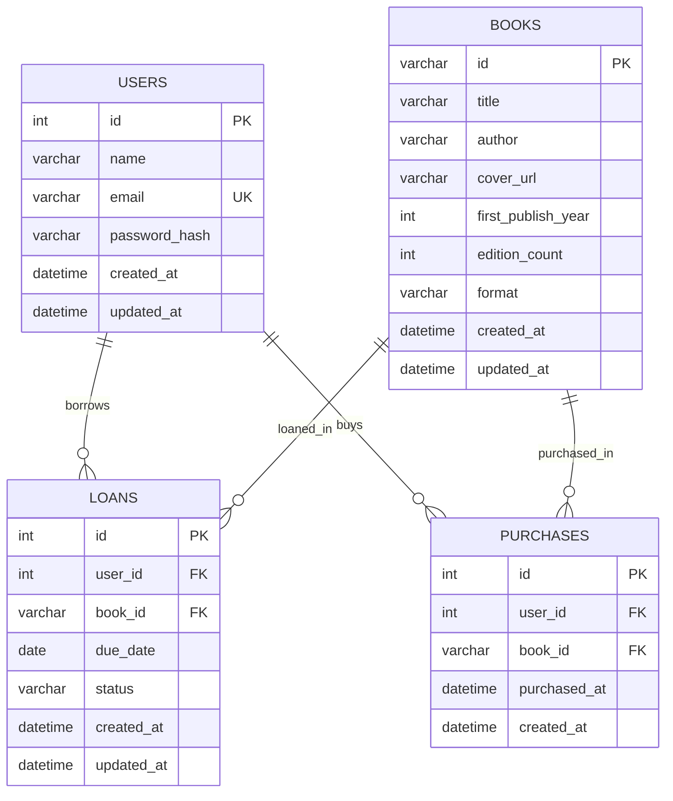

# Library App ERD

## Notes

- `USERS.email` should be unique.
- `LOANS` should prevent duplicated active loans for the same `user_id + book_id`.
- `PURCHASES` can enforce uniqueness by `user_id + book_id` if each ebook is bought once.
- `BOOKS.id` is string-based to align with OpenLibrary-style identifiers currently used in frontend state.
